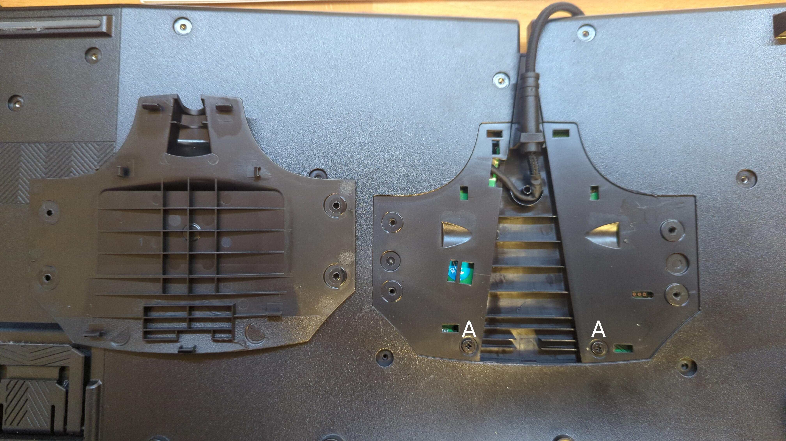

# PERIBOARD-335 Disassembly

This is a basic disassembly guide for the [PERIBOARD-335](https://perixx.com/collections/keyboards/products/px-ergonomic-mechanical-keyboard?variant=43501541916931) mechanical keyboard.
This guide likely applies to the [PERIBOARD-535](https://perixx.com/collections/keyboards/products/px-ergonomic-mechanical-keyboard?variant=43501541818627), the full-size variant, as well.
It's an ergonomic, non-split, wired, mechanical, low-profile keyboard.

Switches: Kailh Choc V1
- Pin placement is incompatible with Kailh Choc V2
- *Blue* switches option are Kailh **Pale** Blue (don't ask me how I found out)

MCU:
- Main: PixArt PAR2862QN
- Co: [WT51F108S](http://www.weltrend.com/upload/website/product/WT51F108S_104S_DataSheet_EN_V1.0.pdf)

Tools needed:

- PH1 head screwdriver
- Some basic prying tool (flat head screwdriver will do)

## Guide

- Remove all visible screws on the back of the keyboard.
  There are 3 different types of screws used here (A, B, C).

- Pry off the plastic covering the cable.

- Two additional screws are now revealed that need to be removed.

- Carefully open the **left hand** aluminum cover vertically from the top.
  At the bottom of the plate, there's still a connector we need to disconnect.

- Disconnect the connector and remove the plate.

- On the **right hand** aluminum cover, there's a connector at the top as well as a screw we have to remove.
  Carefully lift the plate freeing the cable from the plastic guide.

- Carefully open the **right hand** aluminum cover fully from the top.
  At the bottom of the plate, there are two connectors we need to disconnect.

- Open the remaining plate from the top in the same manner.
  This requires some prying, but be careful, there's still one connector at the bottom.

